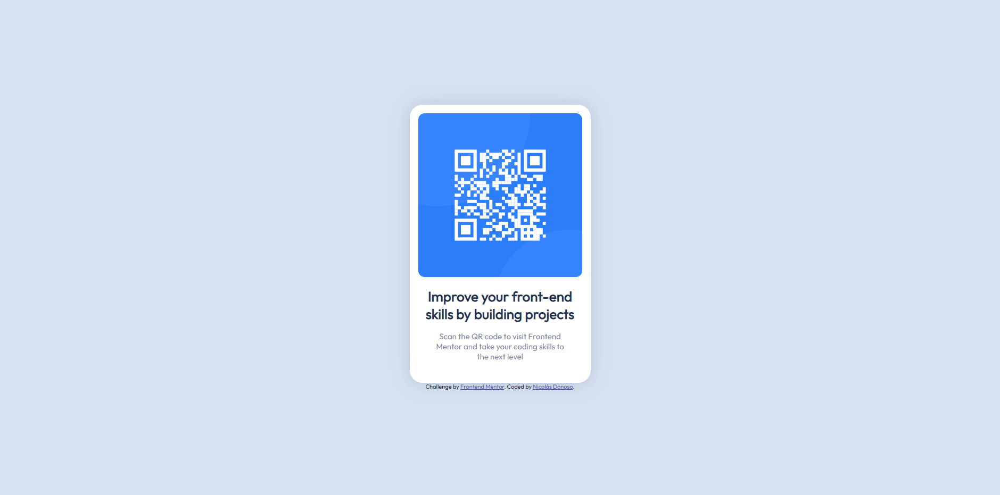

# Frontend Mentor - QR code component solution

This is a solution to the [QR code component challenge on Frontend Mentor](https://www.frontendmentor.io/challenges/qr-code-component-iux_sIO_H). Frontend Mentor challenges help you improve your coding skills by building realistic projects. 

## Table of contents

- [Overview](#overview)
  - [Screenshot](#screenshot)
  - [Links](#links)
- [Built with](#built-with)
- [Author](#author)
### Screenshot

### Links

- Solution URL: [GitHub Repo](https://www.frontendmentor.io/solutions/qr-code-component-35111Scv5W)
- Live Site URL: [GitHub Page](https://sir-floppa.github.io/Frontend-Mentor-QR-Code-Component/)

### Built with

- HTML
- CSS 
- Flexbox

## Author

- Website - [Nicolás Donoso](https://sir-floppa.github.io)
- Frontend Mentor - [@Sir-Floppa](https://www.frontendmentor.io/profile/Sir-Floppa)
- Instagram - [@sir_floppa](https://www.instagram.com/sir_floppa/)
